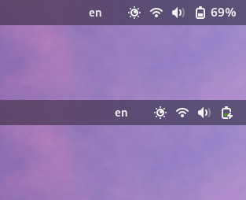

# Autohide Battery Percentage

GNOME Shell extension to hide the battery percentage in the top panel, 
if the computer is plugged in or power saving is on.

Inspired by [Autohide Battery](https://github.com/ai/autohide-battery)

## Install
The extension is available on [Autohide Battery Percentage](https://extensions.gnome.org/extension/6943/autohide-battery-percentage/) page.

## Report Issues
In the [Issues](https://github.com/rukins/autohide-battery-percentage/issues) section you can suggest any improvements and report any bugs you find

## Contributing
This is an open-source project and all contributions are highly welcomed

## License
Released under [MIT License](LICENSE)
